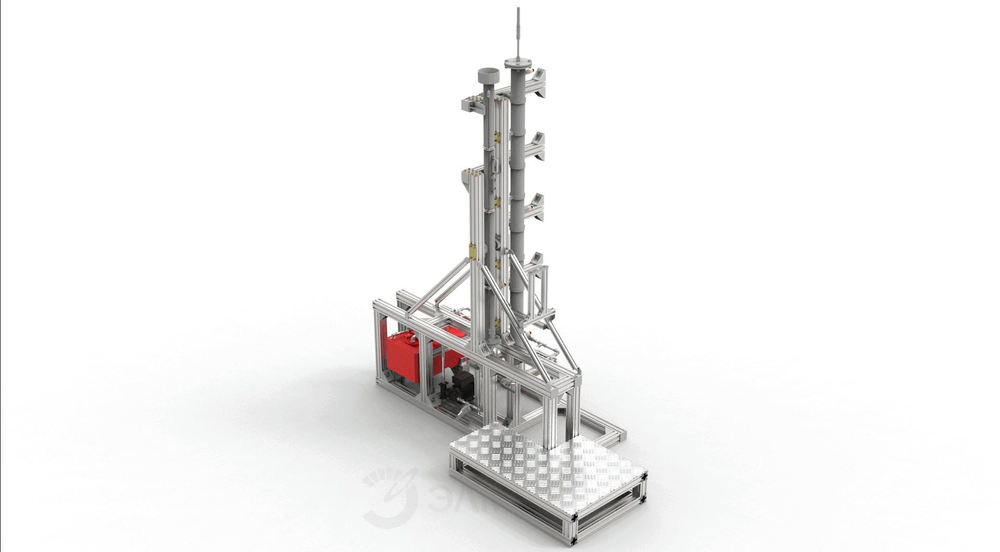
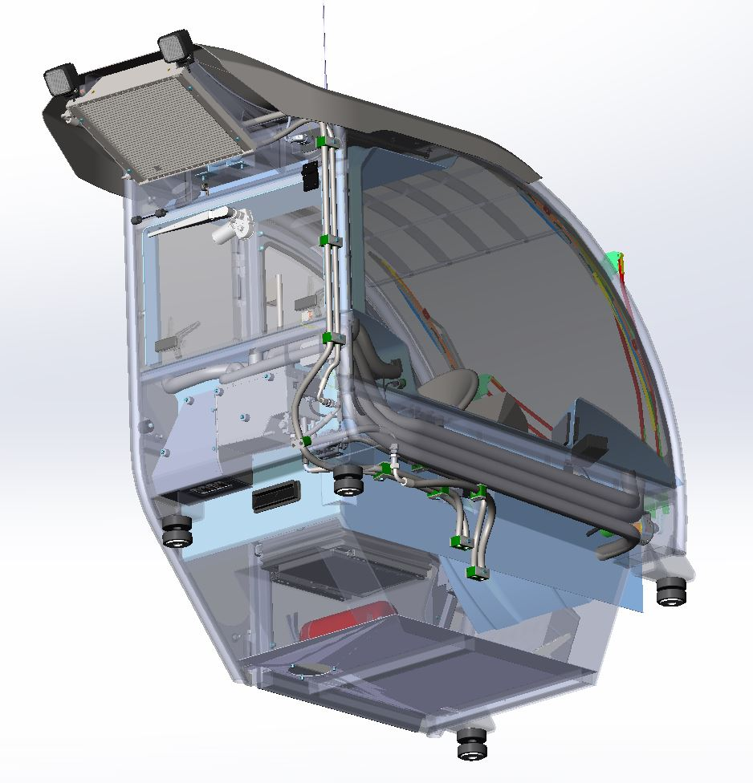
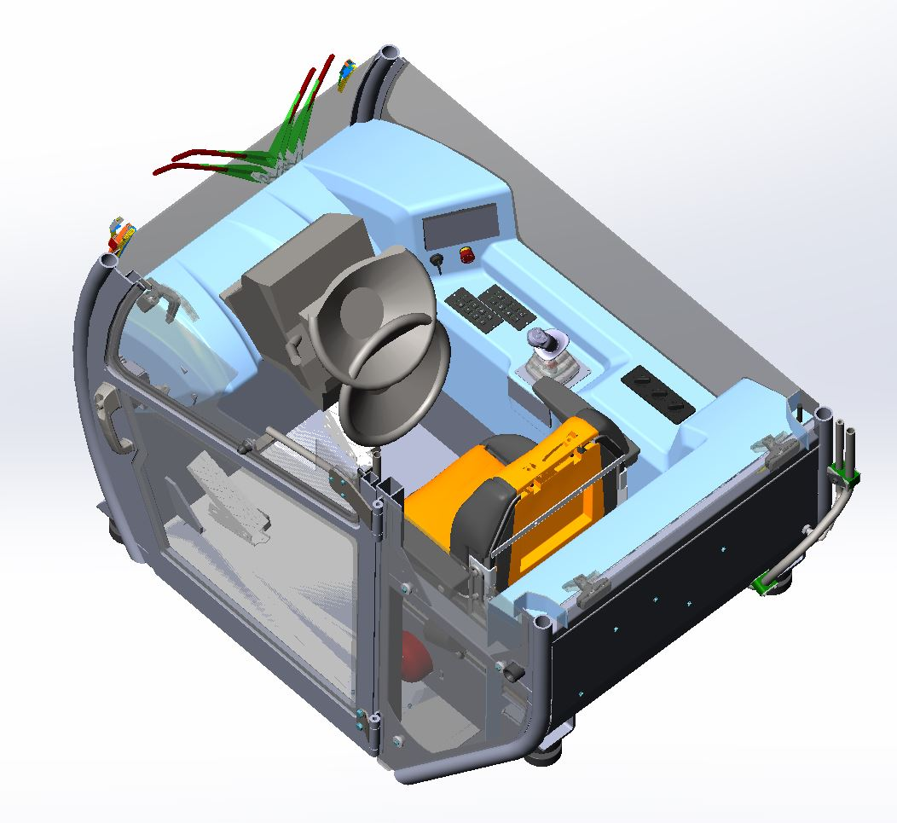

# 2025 
## Hydraulic Level gauge verification stand

### What`s done: 
Concept, equipment selection, hydraulic system design, and calculations. 3D modeling, drawings and visualization. Author control of the assembling process.
### Main software:
Solidworks, Keyshot, MS Office

---

# 2024 
## Telescopic handler cabin
 

### What`s done: 
Concepting, suitable automotive components searching, designing of details, assemblings, and systemes. Everyday coordination of decisions with related development departments.
3D modeling, drawings, author control of the assembling process.
### Main software:
Solidworks, Keyshot, MS Office

---

