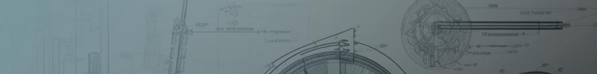

# Pavel Burakov 
### Инженер-конструктор
 

Проектирование машин и металлоконструкций.  
3D-моделирование, чертежи, расчёты.

---

## Области работы
- Машиностроение
- Сельскохозяйственная техника
- Перерабатывающее оборудование

---

## Проекты
### Металлическая рама промышленного оборудования

Проект рамы для установки промышленного агрегата.  
Разработка 3D-модели, чертежей и расчёта прочности.

---
